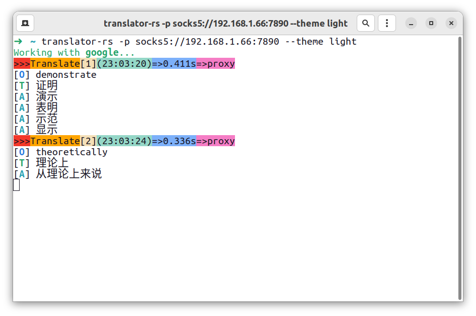
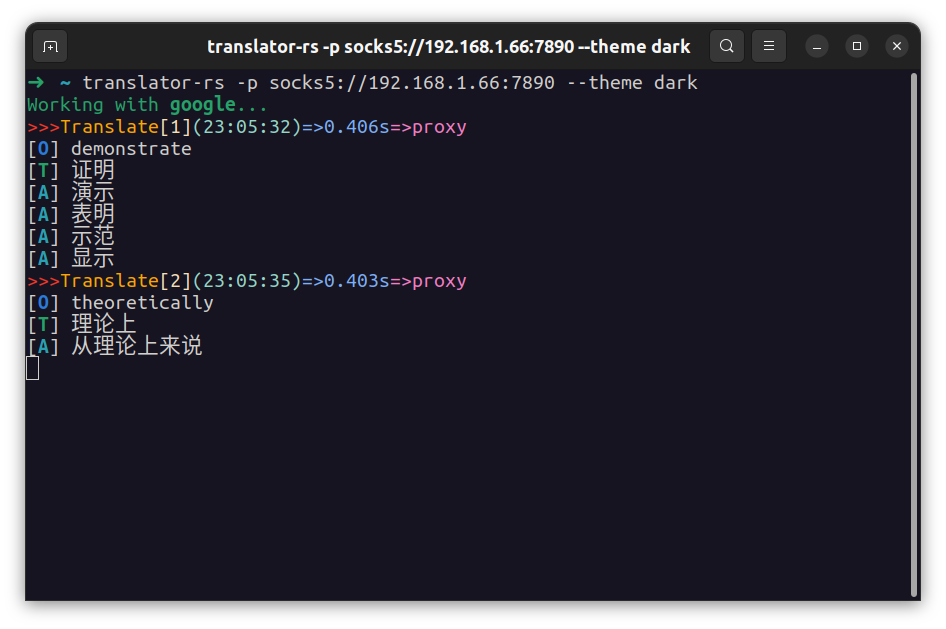

# translator-rs

A simple real time translation of PDF papers written in rust for Linux users, with a translation API for Google. To avoid misunderstandings, rename the program from `rust-translator` to `translator-rs`.

[](https://github.com/rikonaka/translator-rs/actions/workflows/rust.yml)

[中文帮助](https://github.com/rikonaka/translator-rs/blob/main/README_zh.md)

## Features

* A simple selection can be translated to speed up reading papers.
* Long sentence translation with automatic sentence break.
* Support single word to view detailed similar translation.


## Installation

Please install the `xsel` package before using it.

### Installation on Debian and Ubuntu

```bash
sudo apt install xsel
```

### Installation on Fedora

```bash
sudo dnf install xsel
```

### Download binary file

Download and unpack the package from the [release](https://github.com/rikonaka/translator-rs/releases) page, then place the binary file in `/usr/bin` (any `PATH` directory such `/usr/local/bin` anywhere you want).

## Usage

### Linux

If the binary file is **already in the PATH** directory, you can run the following command directly.

```bash
translator-rs
```

If not, use the terminal run with following command.

```bash
./translator-rs
```

Click on a word or a paragraph (tested on Ubuntu 22.04 Gnome with Wayland and X11 desktop environment and Kubuntu22.04 Plasma desktop).

- `O` stands for original text
- `T` stands for translation text
- `A` stands for alternative text

## Option Description

### Theme

We offer two color scheme options

**Light**



**Dark**



### Switch translate API

Switch from the default google translate to deepl. The translation API for DeepL is now supported, but requires the user to have an auth key.

```bash
translator-rs -a deepl --auth-key xxxxxxxx:xx
```

or pro

```bash
translator-rs -a deeplpro --auth-key xxxxxxxx:xx
```

### Proxy options

**The Google Translate API has been blacklisted in China (2022-9-29), according to the latest firewall rules (GFW), so a proxy option has been added.**

If there is an access timeout, please consider setting a proxy for the translation software, which currently supports the following proxies.

* https proxy
* socks5 proxy

```bash
translator-rs -p socks5://YOUR_PROXY_SERVER_IP:YOUR_PROXY_SERVER_PORT
```

### Switching translation languages

The languages currently supported for translation include, default source language is **English**, and target language is **Chinese**.

* English
* Chinese (Simplified)
* Chinese (Traditional)
* Japanese
* Spanish
* Russian
* Korean
* French
* German
* Italian

If you need to translate into another language rather then default, use the following command to specify `source language` and `target language`.

```bash
translator-rs -s Engligh -t French
```

### Faster sampling speed

If you think the translation speed is slow, you can use `fast` mode (power consumption may be higher than default mode, default interval is `1.0` sec, you can change it to `0.1` sec).

```bash
translator-rs -f 0.1
```

### Clear screen mode

New clear screen mode. The default parameter in this mode clears the previous translations for each `n` translation.

```bash
translator-rs -c
```

If you want to clear the screen after three translations, you can use the following command.

```bash
translator-rs -c 3
```

### Do not show original text

New option of not showing original text. If you want to not show the original text when translating, you can use the following options.

```bash
translator-rs --no-original
```

### No automatic sentence break

Added no automatic sentence break. If you do not want to break the sentence automatically, you can use the option.

```bash
translator-rs --disable-auto-break
```

### Others

Added support for some applications on Linux that do not automatically get selected text. Some Linux applications (like `Zotero`) have the function of intercepting the text selection system call, please select the text then copying it via `ctrl-c`.

```bash
translator-rs --enable-clipboard
```

## Why don't you support gui or tui?

Do not want to waste time in this area, can meet the use of the line 😘, in fact, there is no need for this.

You are welcome to submit any code to improve the program.
