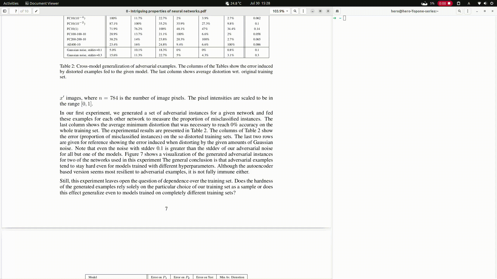

# translator-rs

一个用 rust 写的 PDF 论文简单实时翻译，翻译 API 为 Google 提供（主要支持 Linux 用户，Windows 用户也可以用但是貌似有比这还好的软件？），支持单个单词查看详细相似翻译。

[](https://github.com/rikonaka/translator-rs/actions/workflows/rust.yml)



## 安装

### 使用之前请先安装 `xsel`

```bash
sudo apt install xsel
```

将 [release](https://github.com/rikonaka/translator-rs/releases) 页面下的压缩包解压到本地，之后将文件中的二进制文件移动到 `/usr/bin` 下（任何在 `PATH` 中的目录都行），之后运行命令即可：

```bash
translator-rs
```

或者进入解压后的目录直接执行：

```bash
./translator-rs
```

### 使用

直接点选单词或者一段话既可（在 Ubuntu 22.04 Gnome&Wayland 桌面环境上测试过，还有 Kubuntu22.04 的 Plasma 桌面，其他桌面还没有测试过）。

### 如要自行编译

编译之前请先安装依赖（`Debian` or `Ubuntu`）

```bash
sudo apt install xsel xcb libx11-xcb-dev libxcb-render-util0-dev libxcb-shape0-dev libxcb-xfixes0-dev
```

## 选项说明

### 代理选项

根据最新的防火墙规则（GFW）已经将 Google 翻译 API 列入黑名单，所以新增 proxy 选项。所以如果出现访问超时的情况，请考虑为翻译软件设置代理，目前支持代理：

* https 代理
* socks5 代理

```bash
translator-rs -p socks5://192.168.122.67:1080
```

### 切换翻译语种

目前支持的翻译语种包含了：

* English
* Chinese
* Japanese
* French
* German

如有翻译其他语言的需要，请使用如下命令来指定`源语言`和`目标语言`：

```bash
translator-rs -s Engligh -t French
```

### 加快翻译速度

如果觉得翻译速度慢可以使用 `fast` 模式（功耗可能会比 `slow` 模式高，默认是 `slow` 模式）：

```bash
translator-rs -f
```

新增对 Linux 上某些无法自动获得选取文字应用上的支持。某些无法自动获得选取文字的 Linux 应用现在可以通过 `ctrl-c` 来复制文字之后自动翻译。

### 清屏模式

此模式下的默认参数下每次翻译都会清空之前的翻译。

```bash
translator-rs -c
```

如果想在翻译三次之后清屏，可以使用如下命令：

```bash
translator-rs -c 3
```

### 不显示原文

如果在翻译的时候想不显示原文，可以使用如下选项：

```bash
translator-rs --no-original
```

### 不自动断句

如果不想自动断句，可以使用选项：

```bash
translator-rs --disable-auto-break
```

### 某些 Linux 发行版

某些 Linux 发行版上的软件无法自动提取识别选中的文字，可使用如下选项激活 Linux 剪切板功能，之后使用 `ctrl-c` 复制需要翻译的文字即可。

```bash
translator-rs --linux-use-clipboard
```

## 为什么不支持 gui 或者 tui？

不想在这方面浪费时间，能满足使用就行。😘

## release

release 页面有多个版本下载：

* Linux 另一个版本是使用 `x86_64-unknown-linux-musl` 静态编译的（占用空间小可移植性好）
* Windows 另一个版本是用 `x86_64-pc-windows-msvc` 静态编译的（微软提供的 MSVC 编译器）
* ~~Linux 一个版本版本是使用 `x86_64-unknown-linux-gnu` 静态编译的~~（Linux 默认的 glibc 在某些旧发行版上会出现报错）
* ~~Windows 版本是使用 `x86_64-pc-windows-gnu` 静态编译的~~（和 Windows 的默认编译器 MSVC 相比来说可能会有一些 bug ）
* ~~ARM 版本是使用 `aarch64-unknown-linux-gnu` 静态编译的~~（没什么人用）
