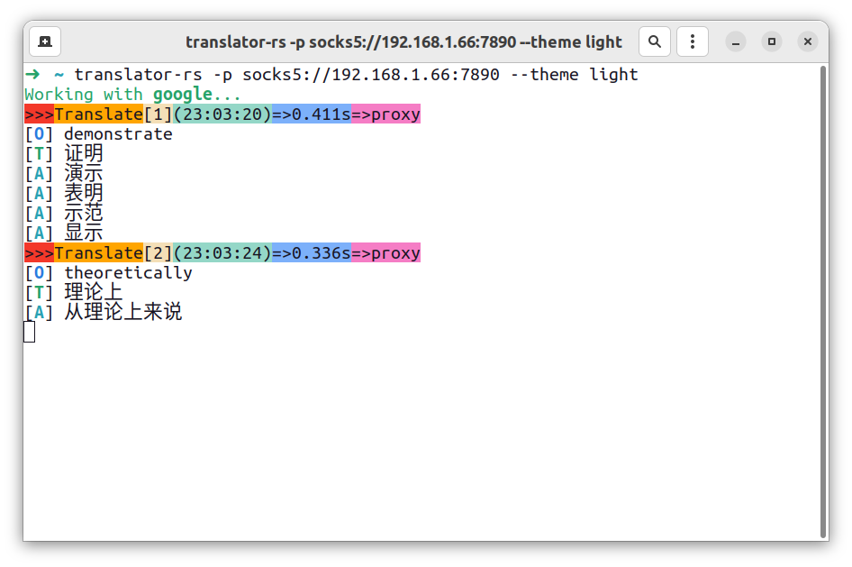
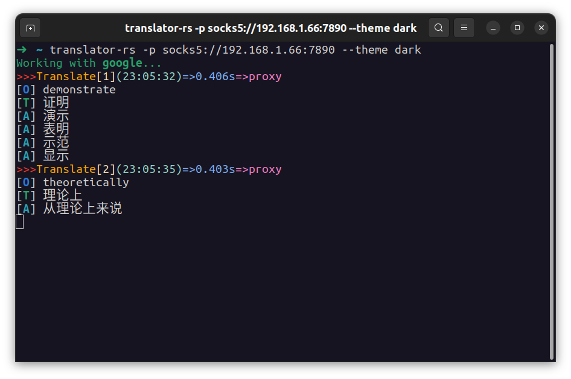

# translator-rs

一个用 rust 写的 PDF 论文简单实时翻译，翻译 API 为 Google 和 DeepL 提供，支持单个单词查看详细相似翻译。

[](https://github.com/rikonaka/translator-rs/actions/workflows/rust.yml)

## 安装

### Linux

使用之前请先安装 `xsel`

```bash
sudo apt install xsel
```

### Windows

请确保机器上有 `powershell`


## 运行


### Linux

之后将 [release](https://github.com/rikonaka/translator-rs/releases) 页面下的压缩包解压到本地，将文件中的二进制文件移动到 `/usr/bin` 下（任何在 `PATH` 中的目录都行），之后运行命令即可：

```bash
translator-rs
```

或者进入解压后的目录直接执行：

```bash
./translator-rs
```

### Windows

由于 Windows 上没有类似的程序获得选中字段，在 Windows 上运行时请使用 `--use-clipboard` 选项

```bash
./transaltor-rs.exe --use-clipboard
```

### 使用

直接点选单词或者一段话既可（在 Ubuntu 22.04 Gnome&Wayland 桌面环境上测试过，还有 Kubuntu22.04 的 Plasma 桌面，其他桌面还没有测试过）。

- `O` 代表原文
- `T` 代表翻译
- `A` 代表同义词

## 选项说明

### 配色方案

提供两种配色方案选择

**Light**



**Dark**



### 切换翻译 API 服务

默认翻译 API 为 Google translate，如果想切换到 DeepL 的 API，可以使用命令：

```bash
translator-rs -a deepl --auth-key xxxxxxxx:xx
```

上面是免费版的，下面是 pro 版的：

```bash
translator-rs -a deeplpro --auth-key xxxxxxxx:xx
```

### 代理选项

根据最新的防火墙规则（GFW）已经将 Google 翻译 API 列入黑名单，所以新增 proxy 选项。所以如果出现访问超时的情况，请考虑为翻译软件设置代理，目前支持代理：

* https 代理
* socks5 代理

```bash
translator-rs -p socks5://192.168.122.67:1080
```

### 切换翻译语种

目前支持的翻译语种包含了：

* English
* Chinese (Simplified)
* Chinese (Traditional)
* Japanese
* Spanish
* Russian
* Korean
* French
* German
* Italian

如有翻译其他语言的需要，请使用如下命令来指定`源语言`和`目标语言`：

```bash
translator-rs -s Engligh -t French
```

### 加快翻译速度

如果觉得翻译速度慢可以使用 `fast` 模式（功耗可能会比模式高，默认间隔为1.0秒，可以改成0.1秒）：

```bash
translator-rs -f 0.1
```

新增对 Linux 上某些无法自动获得选取文字应用上的支持。某些无法自动获得选取文字的 Linux 应用现在可以通过 `ctrl-c` 来复制文字之后自动翻译。

### 清屏模式

此模式下的默认参数下每次翻译都会清空之前的翻译。

```bash
translator-rs -c
```

如果想在翻译三次之后清屏，可以使用如下命令：

```bash
translator-rs -c 3
```

### 不显示原文

如果在翻译的时候想不显示原文，可以使用如下选项：

```bash
translator-rs --no-original
```

### 不自动断句

如果不想自动断句，可以使用选项：

```bash
translator-rs --disable-auto-break
```

### 某些 Linux 发行版 和 Windows 上

某些 Linux 发行版和 Windows 上的软件无法自动提取识别选中的文字，可使用如下选项激活 Linux 剪切板功能，之后使用 `ctrl-c` 复制需要翻译的文字即可。

```bash
translator-rs --use-clipboard
```
